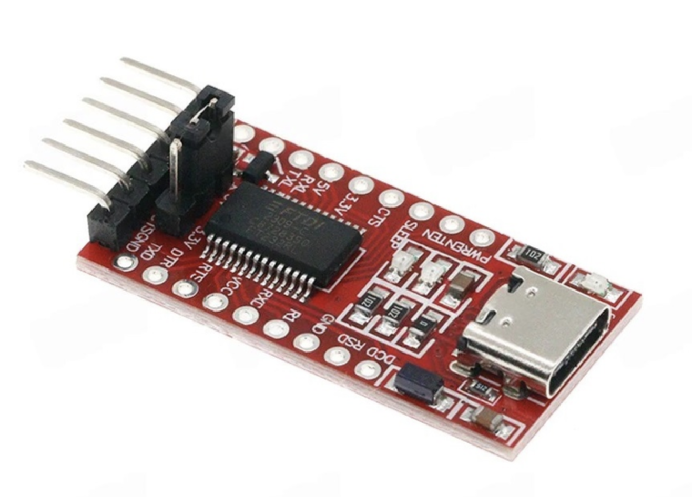
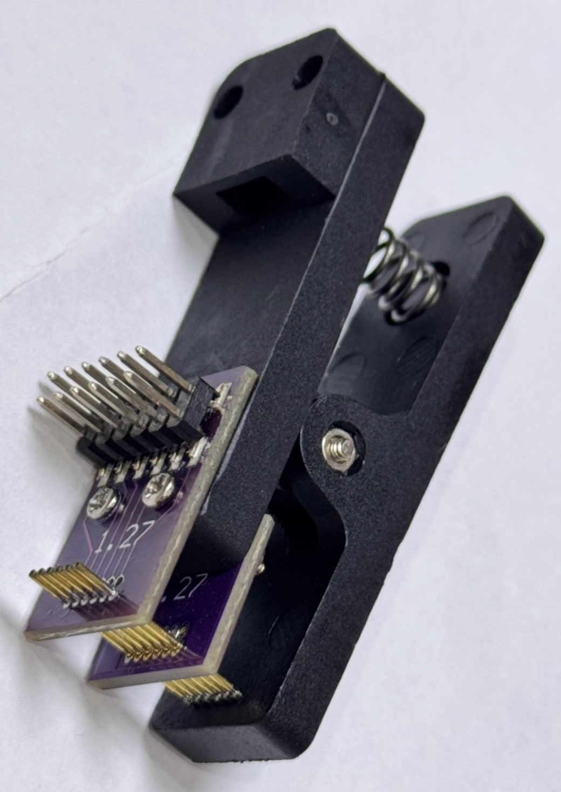

# Flashing
> ⚠️ **Note:** Flashing works **only on Windows**

> ⚠️ **Note 2:**  It is not possible to flash new firmware to a chip with `CRP_LEVEL2`

## Prerequisites
- FTDI adapter with 3.3V

- PCB Pogo Pin Clamp (1x6 1.27mm)

- [JN51xx Production Flash Programmer](https://www.nxp.com/downloads/en/software-development-kits/JN-SW-4107.zip)

## Wiring

### Aqara
Based on `WXKG07LM` and `WXKG11LM` it looks like connection pads have the same order.
Starting from the side with triangle: TDO, TDI, MISO, DC3V, RESETN, GND

Connect the FTDI adapter to the device according to this mapping:
- TDO <-> FTDI RX
- TDI <-> FTDI TX
- MISO <-> GND (only during bootloader mode)
- DC3V <-> FTDI 3.3V
- RESETN <-> GND (optional. Only if you want to have ability to restart a device)
- GND <-> FTDI GND

## Steps
1. Download firmware for your device from the appropriate folder in this repository
2. Connect the device according to the wiring diagram above
3. To enter bootloader mode:
   - Connect MISO to GND
   - Power cycle the device by connecting DC3V to FTDI 3.3V
   - The device is now in bootloader mode and ready for flashing
4. Find the chip port
```powershell
PS C:\NXP\ProductionFlashProgrammer> .\JN51xxProgrammer.exe -l
Available connections:
COM5
```
5. Check device config<br>
```powershell
PS C:\NXP\ProductionFlashProgrammer> .\JN51xxProgrammer.exe -V 0 -s COM5 --deviceconfig
  COM5: Detected JN5169 with MAC address 00:15:8D:00:01:B9:6A:FE
  COM5: Device configuration: JTAG_DISABLE_CPU,VBO_200,CRP_LEVEL1,EXTERNAL_FLASH_NOT_ENCRYPTED,EXTERNAL_FLASH_LOAD_ENABLE
```
6. Flash new firmware to the chip
```powershell
PS C:\NXP\ProductionFlashProgrammer> .\JN51xxProgrammer.exe -V 0 -s COM5 -f D:\Programs\bstudio_nxp\workspace\Aqara_D1_ALT\build\src\AQARA_D1_ALT.bin
```
