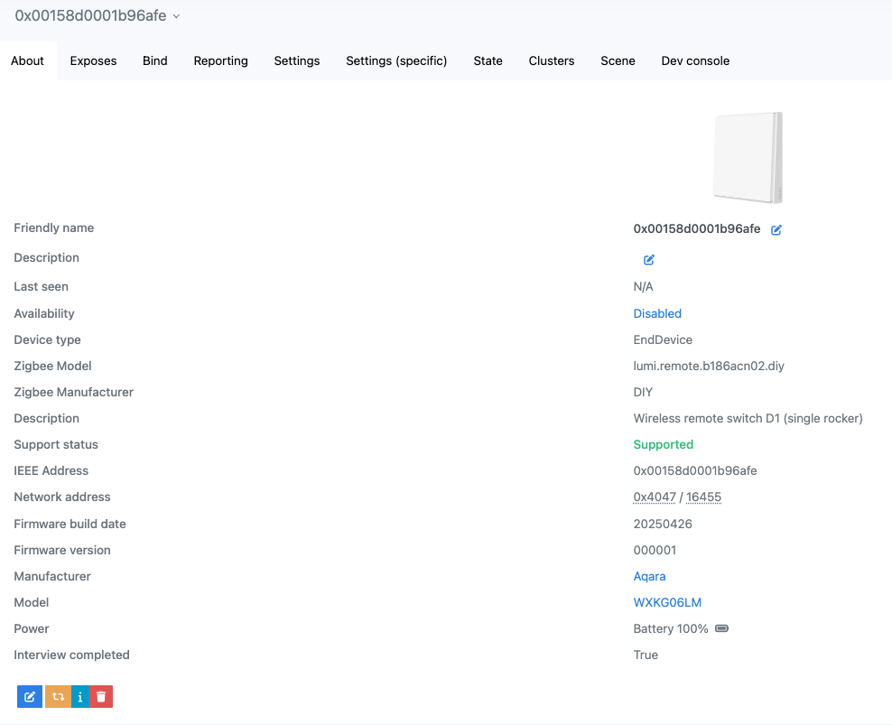
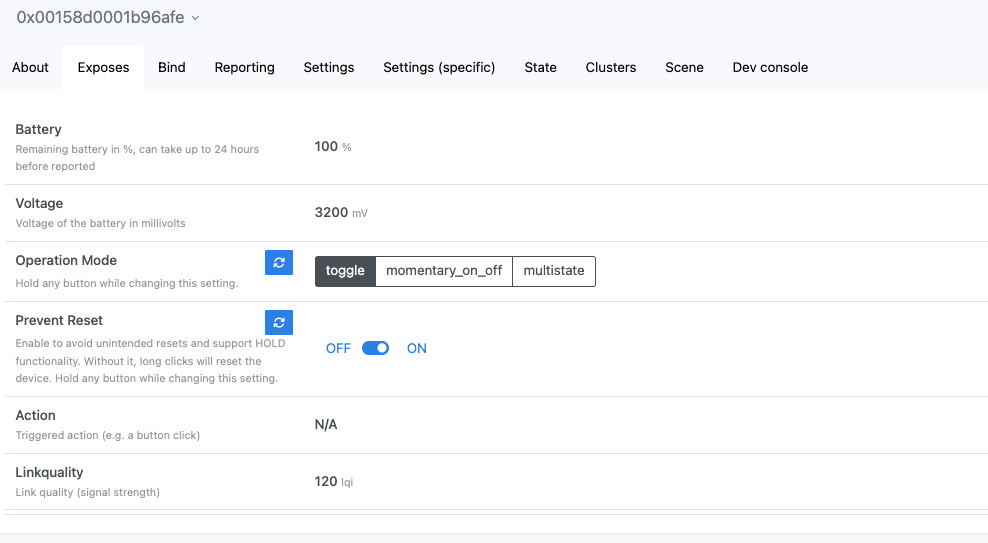
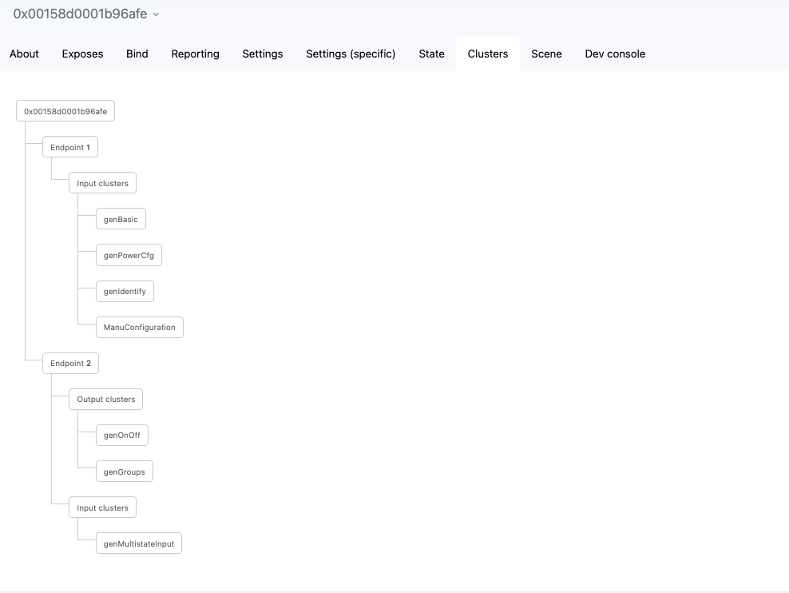

- [Overview](#overview)
- [Features](#features)
- [How to Use](#how-to-use)
- [Screenshots](#screenshots)

# Overview
**[WXKG06LM](https://www.zigbee2mqtt.io/devices/WXKG06LM.html)** come with a very limited feature set and uses the JN5169 chip. 

> ⚠️ **Note:** This firmware has not been tested on a physical WXKG06LM device. However, since it shares the same schematic design as the WXKG07LM, the firmware should work. For reference, see the WXKG07LM board details in the [WXKG07LM documentation](../WXKG07LM/README.md).

> ⚠️ **Note 2:** After flashing custom firmware, the device will no longer be compatible with Aqara coordinators/hubs. It will only work with standard Zigbee coordinators like Zigbee2MQTT, ZHA, or deCONZ.

> ⚠️ **Note 3:** Battery voltage readings may not be very accurate.

**DIOs definition:**
- Left LED - DIO 10
- Right LED - DIO 11
- Button - DIO 14

### Firmwares:
| Firmware | Note |
|----------|---------|
| 000001_20250426_WXKG06LM | Custom firmware with DEBUG disabled |
| 000001_20250426_WXKG06LM_debug | Custom firmware with DEBUG enabled |
| WXKG06LM_original | Original firmware. WXKG06LM and WXKG07LM share the same original firmware |

### Converter:
[WXKG06LM_converter.js](WXKG06LM_converter.js)

# Features
The custom firmware supports next features:
- **Pairing** 
  The device can join a Zigbee network using a standard pairing procedure. To enter pairing mode: press button and hold until the LEDs start blinking rapidly **5 times**.

- **Binding & Groups** 
  Supports [binding](https://www.zigbee2mqtt.io/guide/usage/binding.html) to other devices and groups in `toggle` operation mode.

- **Prevent reset** 
    Supports prevent reset configuration. When enabled manually through configuration, this prevents the device from resetting when long-pressing the button.
    > This configuration must be enabled to use `hold` and `release` events in multistate mode, since these events require detecting long button presses that would otherwise trigger a device reset.

- **Operation Modes** 
  You can choose from several modes depending on your use case:
  - **Multistate** 
    Reports click events using the MultiState Input cluster. Possible values are: `single_click`, `double_click`, `triple_click`, `hold`, `release`

  - **Action** 
    Sends `Toggle` Zigbee command to the binded device on button press. 
    Reports state changes in the Multistate Input cluster: `toggle`. 

  - **Momentary On/Off** 
    Sends `On` when the button is pressed, and `Off` when released. 
    Reports state changes in the Multistate Input cluster: `momentary_pressed`, `momentary_released`. 

# How to Use
Flash a device and install z2m converter.

## Flashing
See [JN5169 Flashing Guide](https://github.com/mgavryliuk/zcf-jn5169-ed-switches/?tab=readme-ov-file#flashing) for detailed flashing instructions.

## Zigbee2MQTT Converter
For more details, see the [External Converters](https://www.zigbee2mqtt.io/advanced/more/external_converters.html) documentation.

# Screenshots

