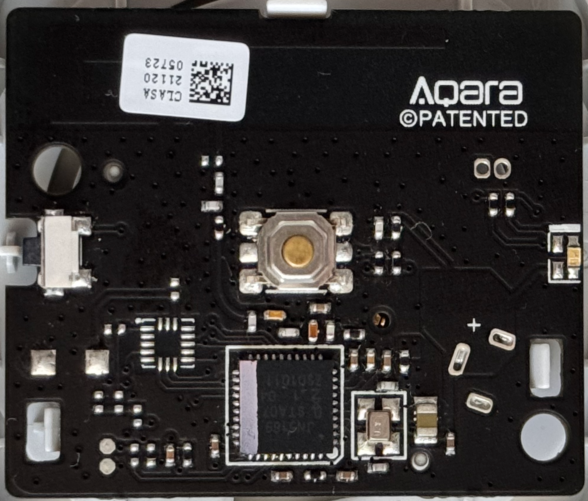
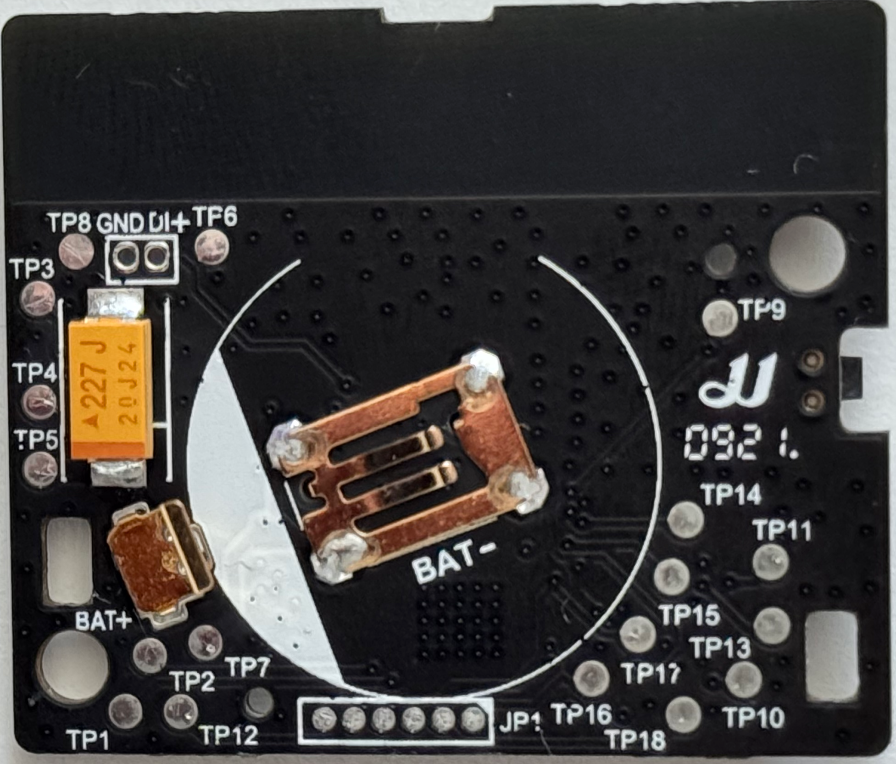
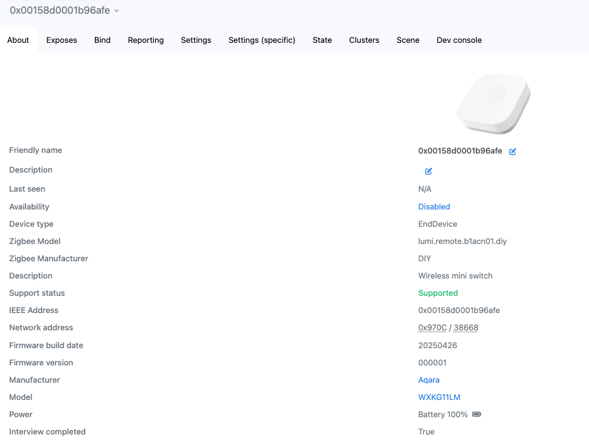
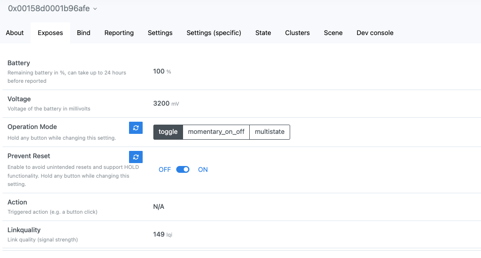
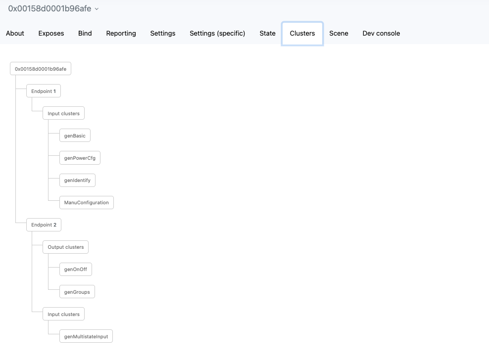

- [Overview](#overview)
- [Features](#features)
- [How to Use](#how-to-use)
- [Screenshots](#screenshots)

# Overview
**[WXKG11LM](https://www.zigbee2mqtt.io/devices/WXKG11LM.html)** is a wireless mini switch that uses the JN5169 chip. 

> ⚠️ **Note:** After flashing custom firmware, the device will no longer be compatible with Aqara coordinators/hubs. It will only work with standard Zigbee coordinators like Zigbee2MQTT, ZHA, or deCONZ.

> ⚠️ **Note 2:** Battery voltage readings may not be very accurate.

### DIOs definition:
- LED - DIO 11
- Main button - DIO 16
- Secondary button - DIO 0

### Firmwares:
| Firmware | Note |
|----------|---------|
| 000001_20250426_WXKG11LM | Custom firmware with DEBUG disabled |
| 000001_20250426_WXKG11LM_debug | Custom firmware with DEBUG enabled |
| WXKG11LM_original | Original firmware |

### Converter:
[WXKG11LM_converter.js](WXKG11LM_converter.js)

### Board:
Version: XX

# Features
The custom firmware supports next features:
- **Pairing** 
  The device can join a Zigbee network using a standard pairing procedure. To enter pairing mode: press button and hold until the LED starts blinking rapidly **5 times**.

- **Binding & Groups** 
  Supports [binding](https://www.zigbee2mqtt.io/guide/usage/binding.html) to other devices and groups in `toggle` operation mode.

- **Prevent reset** 
    Supports configuration to prevent accidental device reset. This feature needs to be manually enabled.

- **Operation Modes** 
  You can choose from several modes depending on your use case:
  - **Multistate** 
    Reports click events using the MultiState Input cluster. Possible values are: `single_click`, `double_click`, `triple_click`, `hold`, `release`

  - **Action** 
    Sends `Toggle` Zigbee command to the binded device on button press. 
    Reports state changes in the Multistate Input cluster: `toggle`.

  - **Momentary On/Off** 
    Sends `On` when the button is pressed, and `Off` when released. 
    Reports state changes in the Multistate Input cluster: `momentary_pressed`, `momentary_released`.

# How to Use
Flash a device and install z2m converter.

## Flashing
See [JN5169 Flashing Guide](https://github.com/mgavryliuk/zcf-jn5169-ed-switches/?tab=readme-ov-file#flashing) for detailed flashing instructions.

## Zigbee2MQTT Converter
For more details, see the [External Converters](https://www.zigbee2mqtt.io/advanced/more/external_converters.html) documentation.

# Screenshots

