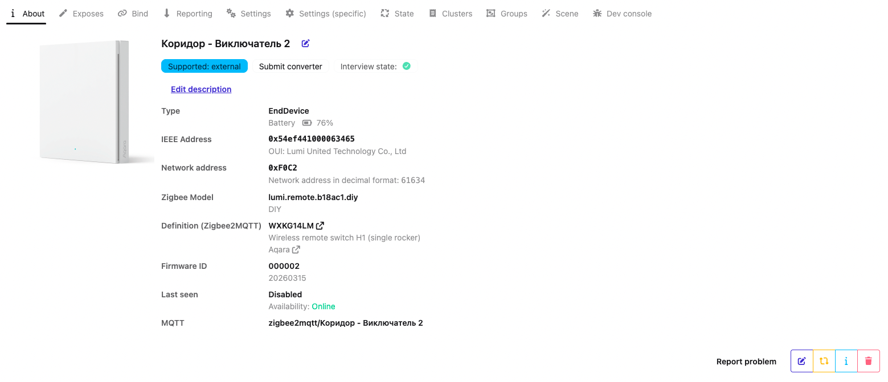
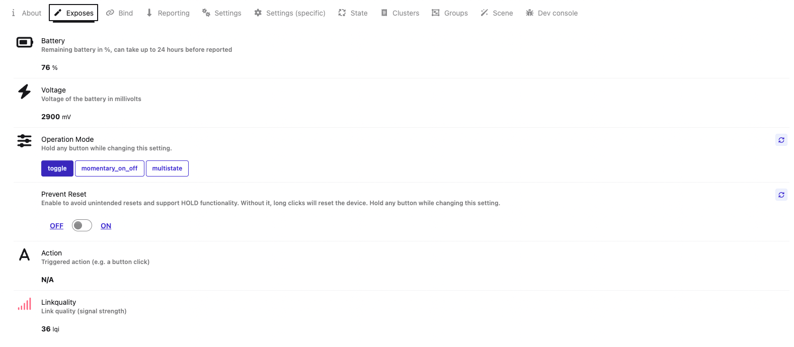
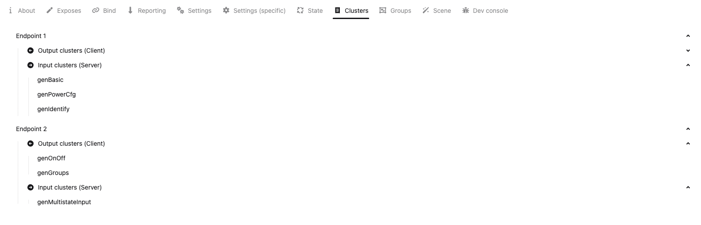

> ⚠️ **Note:** After flashing custom firmware, the device will no longer be compatible with Aqara coordinators/hubs. It will only work with standard Zigbee coordinators like Zigbee2MQTT, ZHA, or deCONZ.

- [Overview](#overview)
- [Features](#features)
- [Usage](#usage)
- [Screenshots](#screenshots)

# Overview
**[WXKG14LM](https://www.zigbee2mqtt.io/devices/WXKG14LM.html)** is a wireless remote switch that is based on the JN5189 chip.

**Sources:** https://github.com/mgavryliuk/zcf-jn5189-ed-switches  
**Board Documentation:** https://github.com/mgavryliuk/zcf-jn5189-ed-switches/blob/master/firmwares/WXKG14LM/README.md  
**Firmwares:** Use the latest release from the [`Releases`](https://github.com/mgavryliuk/zcf-jn5189-ed-switches/releases) page  
**Z2M Converter:** https://github.com/mgavryliuk/zcf-jn5189-ed-switches/blob/master/firmwares/WXKG14LM/z2m_converter.js

# Features
The custom firmware supports next features:
- **Pairing**  
  The device can join a Zigbee network using a standard pairing procedure. To enter pairing mode, press button and hold until the LED start blinking rapidly.

- **Binding & Groups**  
  Supports [binding](https://www.zigbee2mqtt.io/guide/usage/binding.html) to other devices and groups in `toggle` operation mode.

- **Prevent reset**  
    Supports prevent reset configuration. When enabled manually through configuration, this prevents the device from resetting when long-pressing the button.
    > This configuration must be enabled to use `hold` and `release` events in multistate mode, since these events require detecting long button presses that would otherwise trigger a device reset.

- **Operation Modes**  
  You can choose from several modes depending on your use case:
  - **Multistate**  
    Reports click events using the MultiState Input cluster. Possible values are: `single_click`, `double_click`, `triple_click`, `hold`, `release`

  - **Action**  
    Sends `Toggle` Zigbee command to the bound devices on button press.  
    Reports state changes in the Multistate Input cluster: `toggle`.  

  - **Momentary On/Off**  
    Sends `On` Zigbee command when the button is pressed, and `Off` when released.  
    Reports state changes in the Multistate Input cluster: `momentary_pressed`, `momentary_released`.  

# Usage
1. [Flash the device](https://github.com/mgavryliuk/zcf-jn5189-ed-switches#flashing)
2. Install the [Z2M converter](https://github.com/mgavryliuk/zcf-jn5189-ed-switches/blob/master/firmwares/WXKG14LM/z2m_converter.js)
3. [Pair the device](https://github.com/mgavryliuk/zcf-jn5189-ed-switches#pairing-after-flashing)

# Screenshots

